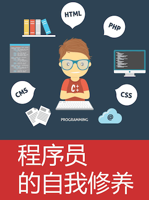

  

 

### 1. JavaScript基础

#### 1.1 闭包

- 闭包的定义
- 闭包能用来干什么（至少三个场景）

#### 1.2 this

- <mark>this的指向（箭头函数，实例方法，全局调用，事件回调，setTimeout）</mark>
- call/apply/bind的区别，如何手动实现？

#### 1.3 原型

- 原型和原型链
- 如何优雅的手动设置原型链（不许使用__proto__)
- 为什么有的库喜欢把方法定义的原型对象上
- instanceof的真正含义

#### 1.4 继承

- 继承的最佳实现
- A() vs new A()

#### 1.5 Promise

- async/await vs promise
- promise A+
- Promise.resolve() vs setTimeout(0)

#### 1.6 Event loop

- 浏览器 vs Nodejs
- 宏任务和微任务

#### 1.7 事件委托

- 如何在捕获阶段触发回调
- 自定义事件

### 1.8 数据劫持

- Object.defineProperty vs Proxy

### 2. CSS

- disabled vs readonly
- 伪元素和伪类
- z-index层叠关系
- viewport
- flex
- grid
- 16:9怎么实现
